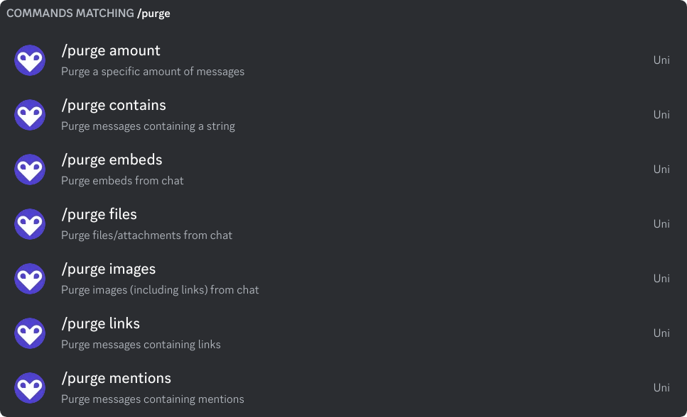
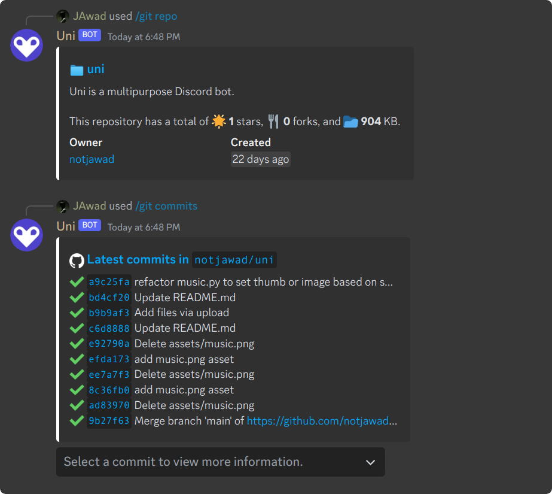
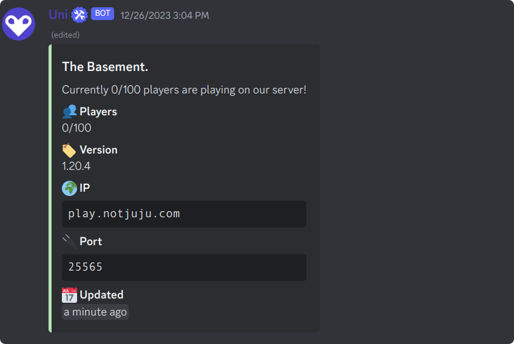
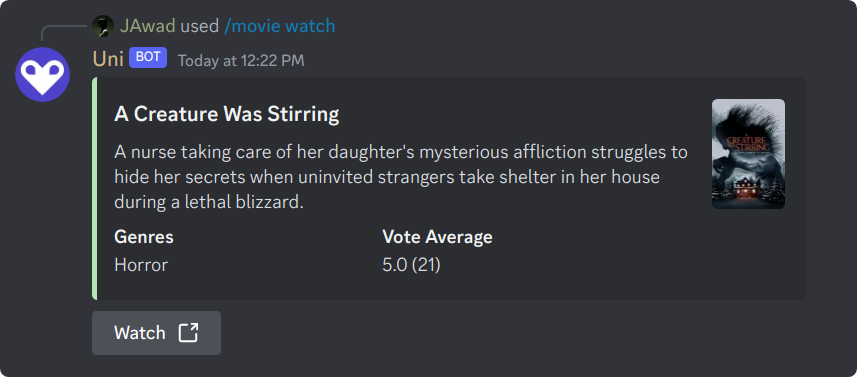

# Uni - _The Last Multipurpose Bot, Ever_

    

From basic server management to fun games, music playback, and even AI interactions, Uni has got you covered.

  <!-- You can add your badges here -->
  <!-- If you have never added badges, head over to https://img.shields.io/badges/static-badge, follow the instructions and generate URL links to add below -->
  
  
  
  

## Features

- **Server Management:** Welcome/leave messages, server info control.
- **Moderation:** Kick, ban, manage threads, timeouts, and more.
- **Role Management:** Add, remove, modify roles, set permissions.
- **Message Handling:** Purge messages, nuke channels, set slowmode.
- **Logging & Security:** Enable/disable logging, anti-phishing, VirusTotal scan.
- **Games & Fun:** Wordle, Hangman, Chess, Akinator, and more.
- **Media & Entertainment:** Music playback, LastFM, Spotify, Valorant profiles, Twitch notifications.
- **Utility Commands:** Timezone management, word definitions, server stats.

  
View All Commands

### Server Management:

1. `/welcome enable` - Enable welcome messages
2. `/welcome disable` - Disable welcome messages
3. `/welcome channel` - Set the welcome channel
4. `/welcome` - Welcome messages
5. `/leave enable` - Enable leave messages
6. `/leave disable` - Disable leave messages
7. `/leave channel` - Set the leave channel
8. `/leave` - Leave messages
9. `/seticon` - Set a new guild icon
10. `/setsplash` - Set a new guild splash background
11. `/setbanner` - Set a new guild banner
12. `/pin` - Pin the most recent message in the channel
13. `/server` - Get some information about the server
14. `/whois` - Get information about a user.
15. `/statistics` - Get simple statistics about the server.
16. `/voicestats` - Setup an auto updating voice leaderboard embed.
17. `/timeout` - Mutes the selected member using Discord's timeout feature
18. `/untimeout` - Unmutes the selected member
19. `/imute` - Removes selected member's permission to attach files and use embed links
20. `/iunmute` - Restores selected member'ss permission to attach files and use embed links

### Role Management:

1. `/role humans` - Add a role to all humans in the guild
2. `/role humansremove` - Remove a role from all humans in the guild
3. `/role delete` - Delete a role from the guild
4. `/role mentionable` - Toggle mentioning a role
5. `/role icon` - Set an icon for a role

### Message Handling:

1. `/purge amount` - Purge a specific amount of messages
2. `/purge embeds` - Purge embeds from chat
3. `/purge files` - Purge files/attachments from chat
4. `/purge images` - Purge images (including links) from chat
5. `/purge contains` - Purge messages containing a string
6. `/purge links` - Purge messages containing links
7. `/purge mentions` - Purge messages containing mentions
8. `/nuke` - Nuke (Clone) the current channel
9. `/slowmode` - Set the slowmode for the current channel
10. `/rename` - Assigns the selected user a new nickname in the guild
11. `/topic` - Sets the topic for the current channel
12. `/logging enable` - Enable logging in the guild
13. `/logging disable` - Disable logging in the guild
14. `/antiphishing` - Enable or disable anti-phishing
15. `/virustotal above` - Scan the above message's file with VirusTotal

### Games and Fun:

1. `/wordle` - Play a game of Wordle!
2. `/hangman` - Play a game of Hangman!
3. `/tictactoe` - Play a game of Tic Tac Toe!
4. `/connectfour` - Play a game of Connect Four!
5. `/chess play` - Play a game of Chess!
6. `/chess whois` - Get information about a chess player on Chess.com.
7. `/chess stats` - Get stats about a chess player on Chess.com.
8. `/chess daily` - Get the daily chess puzzle.
9. `/akinator` - Play a game of Akinator!
10. `/rps` - Play a game of Rock Paper Scissors!
11. `/reactiongame` - Play a game of Reaction Game!
12. `/uwu` - Uwuify text
13. `/quickpoll` - Add up/down arrow to message initiating a poll

### Utility Commands:

1. `/timezone set` - Set your timezone
2. `/timezone list` - List all timezones
3. `/timezone get` - Get a user's timezone
4. `/timezone remove` - Remove your timezone
5. `/timezone all` - List all users' timezones
6. `/define` - Get the definition of a word.
7. `/urban` - Get the Urban Dictionary definition of a word.
8. `/inviteinfo` - Get information about an invite code.
9. `/hex` - Grab the most dominant color from an image
10. `/screenshot` - Get a screenshot of a website
11. `/highlight add` - Add a highlighted keyword
12. `/highlight remove` - Remove a highlighted keyword
13. `/highlight list` - List your highlighted keywords
14. `/highlight` - Set notifications for when a keyword is said
15. `/reminders add` - Add a reminder.
16. `/reminders view` - View a list of your reminders.
17. `/reminders delete` - Delete a reminder.
18. `/reminders clear` - Clear all of your reminders.
19. `/reminders` - Reminder related commands.
20. `/avatar` - Get a user's avatar.
21. `/about` - Get some useful (or not) information about the bot.
22. `/vote` - Vote for the bot on top.gg.
23. `/version` - Gets the current version of the

## Screenshots

## Contribute

Uni is an open-source project, and contributions are welcome! If you have coding skills or want to contribute in other ways, feel free to get involved. Here's how you can contribute:

1. **Code Contributions:**

   - Fork the repository.
   - Create a new branch for your changes.
   - Make your improvements and submit a pull request.

2. **Bug Reports:**
   - Report any bugs or issues on the [GitHub Issues](https://github.com/notjawad/uni/issues) page.
   - Include detailed information about the problem and steps to reproduce it.
