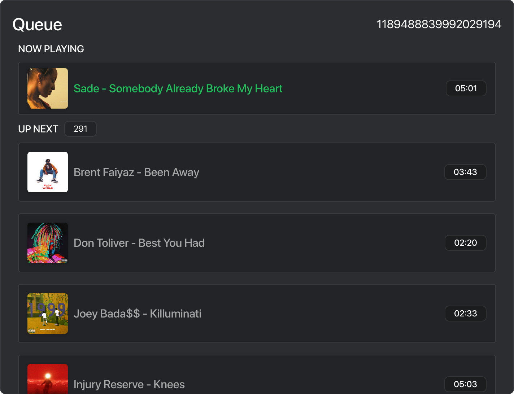
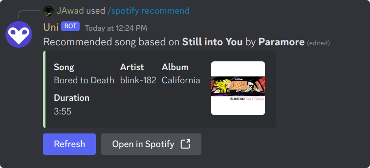
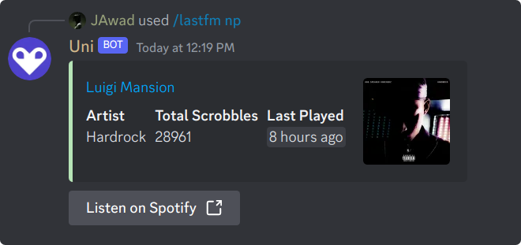
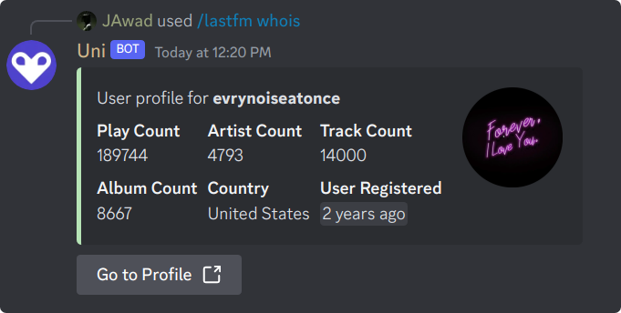
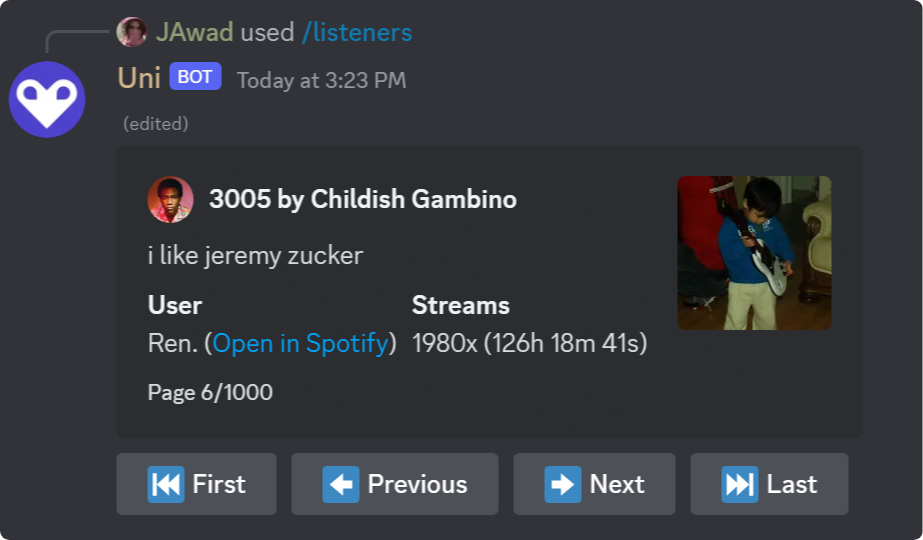

# Uni - _The Last Multipurpose Bot, Ever_

    

From basic server management to fun games, music playback, and even AI interactions, Uni has got you covered.

  
  
  

## Features

- **Server Management:** Welcome/leave messages, server info control.
- **Moderation:** Kick, ban, manage threads, timeouts, and more.
- **Role Management:** Add, remove, modify roles, set permissions.
- **Message Handling:** Purge messages, nuke channels, set slowmode.
- **Logging & Security:** Enable/disable logging, anti-phishing, VirusTotal scan.
- **Media & Entertainment:** Music playback, LastFM, Spotify, Valorant profiles, Twitch notifications.
- **Utility Commands:** Timezone management, word definitions, server stats.

  
View Screenshots

## Contribute

Uni is an open-source project, and contributions are welcome! If you have coding skills or want to contribute in other ways, feel free to get involved. Here's how you can contribute:

1. **Code Contributions:**

   - Fork the repository.
   - Create a new branch for your changes.
   - Make your improvements and submit a pull request.

2. **Bug Reports:**
   - Report any bugs or issues on the [GitHub Issues](https://github.com/notjawad/uni/issues) page.
   - Include detailed information about the problem and steps to reproduce it.
